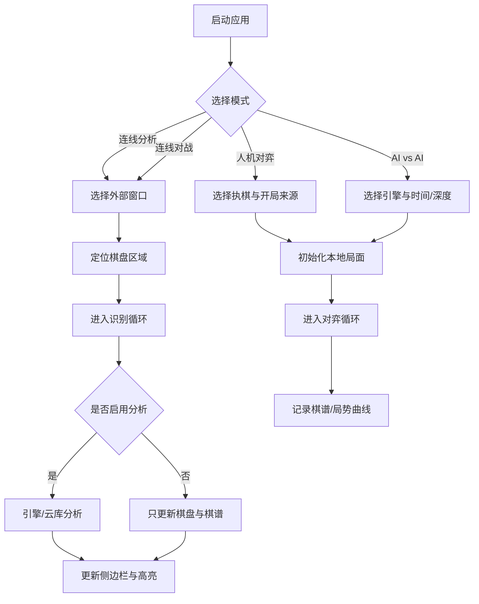
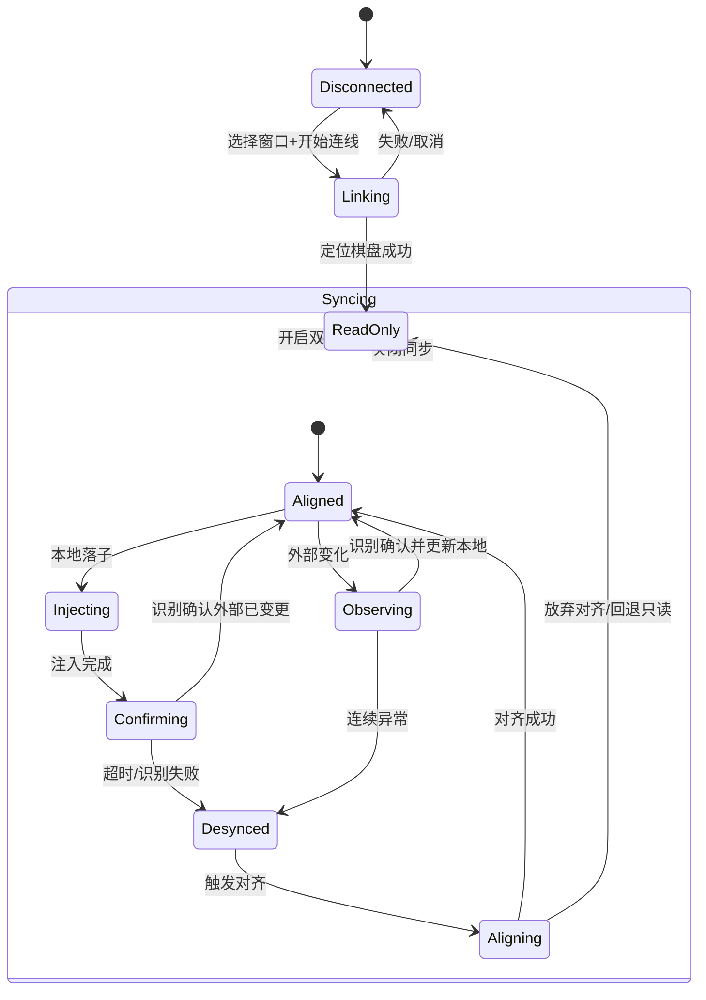
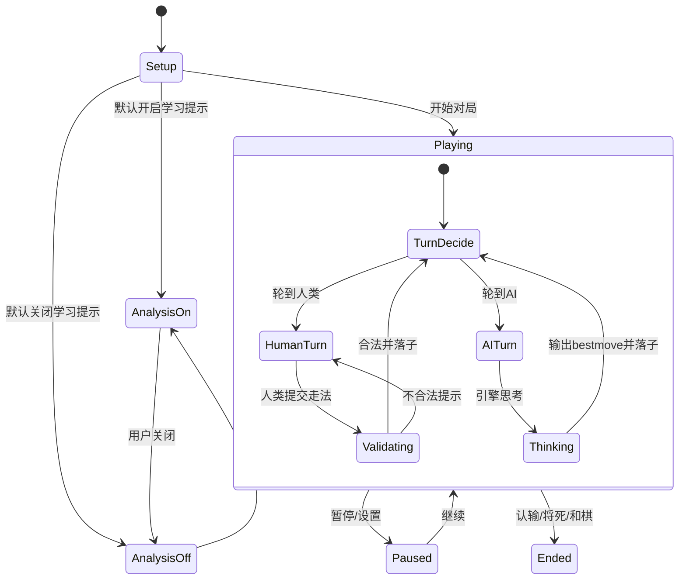
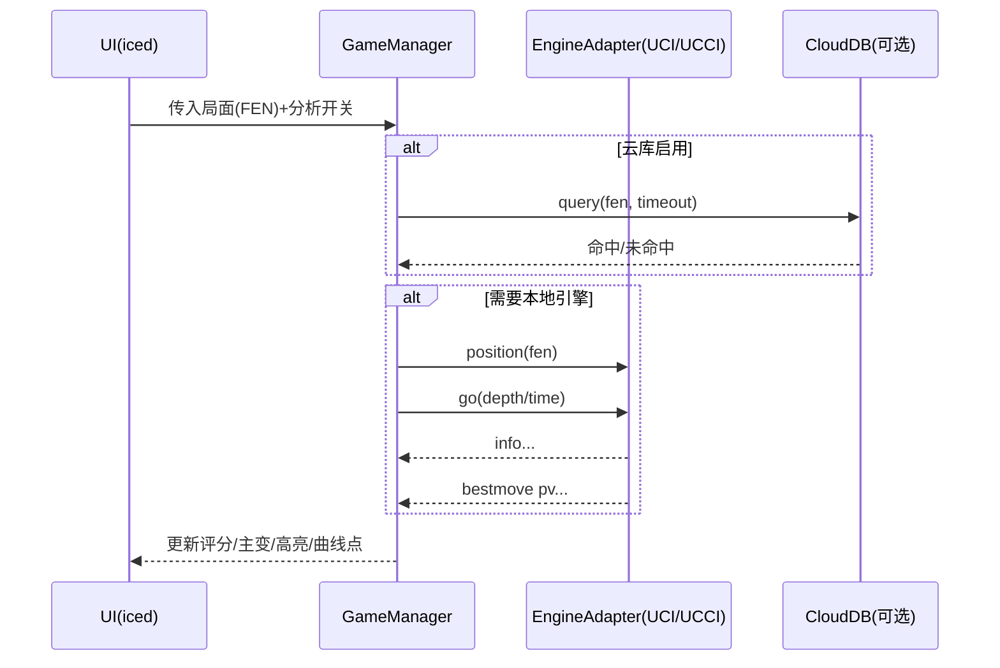

# 中国象棋游戏助手（正式版）PRD

版本：v1.0（正式版规划）  
工程约束：Rust 1.92 / Cargo 1.92 / edition 2024  
最后更新：2026-01-27

实施路径约定：正式版代码在仓库根目录下的 `restruct/` 目录内落地（与 Demo 并存，逐步迁移）。

## 1. 背景与问题

Demo 版本已验证“外部窗口连线 → 截图 → 棋盘/棋子识别（YOLOv8 onnx）→ 引擎分析（Pikafish）→ 侧边栏提示”的核心链路，可用于在线对战平台的辅助分析。但要成为可长期使用的“学习型助手”，还缺少：

- 人机对战与学习闭环（练习、提示、复盘、棋谱、局势图）
- 连线模式的“对局级能力”（棋谱保存、局势曲线、可靠同步、交互控制）
- 引擎管理的通用化（UCI/UCCI、外部引擎、协议参数）
- 多模式一致的棋盘方向体验（棋盘反转）
- UI 技术栈升级与架构重构（由 Tauri/Vue 迁移至 iced 0.14）

## 2. 产品目标

### 2.1 北极星目标
让用户在“连线对局”与“人机练习”两种场景下，以最少打断对局的方式获得可解释、可回放、可积累的学习收益。

### 2.2 成功指标（建议）
- 识别稳定性：连续识别同一局面抖动率 < 1%（按采样窗口计）
- 同步稳定性：开启双向同步后，自动落子成功率 ≥ 99%（可回退重试）
- 学习效率：单局平均查看提示次数、复盘次数、收藏局面次数等
- 性能：常见设备下分析刷新（识别+引擎）可达 2–5 FPS 的“可用”水平（非硬指标，可按配置动态降级）

## 3. 用户画像与使用场景

### 3.1 用户画像
- 初中级象棋爱好者：需要“下一步建议 + 简短解释 + 常见陷阱提醒”
- 进阶玩家：需要“多PV、局势曲线、开局/中局标签、可导出棋谱复盘”
- 自我对弈训练者：需要“人机对战 + 可控制提示强度 + 复盘”

### 3.2 典型场景
- S1 连线分析：用户在外部平台对局，助手识别局面并提示最佳手段
- S2 连线双向同步：用户在助手棋盘走子，外部平台自动跟随落子（或相反）
- S3 人机练习：用户选择执红/执黑/AI vs AI，开启或关闭“学习提示”
- S4 复盘学习：保存对局，回放、标注关键节点、查看局势曲线与引擎建议

## 4. 范围与非范围

### 4.1 范围（v1.0）
- 模式：连线分析、连线对战（双向同步）、人机对弈、AI vs AI
- 开局来源：默认开局、上传图片识别、FEN 输入
- 引擎：内置 Pikafish；支持外部引擎（UCI/UCCI）与参数配置
- 数据：棋谱保存/导出（PGN/FEN）、局势图、基本对局管理
- UI：iced 0.14 桌面端（Windows/macOS/Linux）

### 4.2 非范围（v1.0 暂不做）
- 自研引擎（可预留接口）
- 复杂数据库/云同步（优先文件化存储；可预留未来同步）
- 大规模开局库/残局库搜索（v1.0 做最小可用的开局提示与接口预留）

## 5. 核心概念与术语

- **局面**：棋盘上 10x9 的棋子分布 + 行棋方；以 **FEN** 表示（中象 FEN）
- **着法**：建议统一内部用 **ICCS 坐标着法**（如 `h2e2`），展示层可转中文着法
- **棋谱**：对局走子序列 + 元信息（选用 PGN 作为主要导出格式；可扩展标签）
- **引擎协议**：
  - **UCI**：国际象棋通用引擎协议（中象引擎常兼容其命令形态）
  - **UCCI**：中国象棋通用引擎协议（参考 xqbase 资料）
- **连线**：选择外部窗口并持续截图识别
- **双向同步**：助手棋盘与外部平台棋盘“互相驱动”，通过识别校验与输入注入实现

FEN 规范说明：v1.0 以 Demo 现有 FEN 约定为准，且其符合中国象棋标准格式。标准参考（实现时使用该文档作为权威基线）：

```text
https://www.xqbase.com/protocol/cchess_fen.htm
```

## 6. 信息架构（页面与模块）

参考效果图（友商）：`/Users/atopx/workspace/public/chessboard/docs/chess.png`  
建议正式版信息架构保持“棋盘为中心 + 右侧分析/棋谱侧栏 + 顶部工具栏”的稳定布局。

### 6.1 顶部工具栏
- 新局
- 悔棋/前进（回放模式）
- 提示（一次性提示/提示强度）
- 设置（模式、识别、引擎、同步、快捷键、存储）
- 棋谱（打开/保存/导出/管理）

### 6.2 主区域
- 棋盘（可反转、支持拖拽或点选走子）
- 右侧栏（可切换/折叠）：
  - 局势分析（评分、胜率/优势仪表、主要变化）
  - 棋谱记录（步列表、可跳转、标注）
  - 提示面板（学习模式下对双方的建议）

## 7. 功能需求（按模块）

优先级标记：P0 必须 / P1 重要 / P2 可延后

### 7.1 模式系统（P0）
- P0 支持模式切换：
  - 连线分析（只读外部棋盘）
  - 连线对战（双向同步）
  - 人机对弈（我方执红/我方执黑）
  - AI vs AI（引擎对战）
- P0 切换模式时：
  - 能安全停止上一模式的后台任务（识别、引擎、输入注入）
  - 清理 UI 状态（提示高亮、棋谱面板、局势图）
  - 允许保留“当前局面/棋谱”作为新模式起点（可配置）

### 7.2 引擎管理（P0）
- P0 内置引擎：Pikafish（随应用打包）
- P0 支持引擎来源：
  - 内置引擎（默认）
  - 外部引擎（用户选择可执行文件）
- P0 支持协议选择：UCI / UCCI（按引擎配置指定）
- P0 支持通用参数：
  - Threads、Hash、Depth、Time（允许同时配置；任一达到条件即可停止分析）
  - 随机性/选择性（若协议支持）
  - NNUE/Eval 文件路径（若引擎需要）
- P1 多引擎配置预设（引擎 Profile）：便于快速切换
- P1 允许启用“云库/云引擎”（如 chessdb）作为前置查询（可开关、超时）
- 约定：默认内置引擎 Pikafish 使用 UCI 协议

### 7.3 连线识别（P0）
- P0 选择外部窗口（展示窗口列表：标题/应用名/尺寸）
- P0 自动定位棋盘区域（第一次识别棋盘框，并锁定裁剪区域）
- P0 按固定间隔截图识别，输出：
  - 当前阵营/视角（红/黑/未知）
  - 当前局面（10x9）
  - 转换后的 FEN
- P0 抖动处理：
  - 识别结果需“二次确认”或滑动窗口一致性检查后才进入状态机
  - 识别失败/无棋盘时不污染当前局面
- P1 识别参数可调：
  - 识别间隔、确认间隔、置信度阈值（高级设置）
- P1 支持“旋转棋盘识别模型”（针对外部平台旋转棋盘渲染）

### 7.4 局势分析与提示（P0）
- P0 在连线分析、人机对弈、AI vs AI 中提供：
  - 当前评分（score）、深度（depth）、耗时（time）
  - Top N 主变（PV）与中文走法展示
  - 棋盘高亮“推荐走法”起止点
- P0 学习模式下支持“启用/禁用分析”（对局中可随时开关）：
  - 开启：对双方均显示下一步建议（侧边栏展示）
  - 关闭：仅记录棋谱，不实时提示
- P1 局势图（优势曲线）：
  - 每步记录一次评估值（可采样）
  - 支持点击曲线跳转到对应步

### 7.5 棋谱与对局管理（P0）
- P0 自动记录棋谱（无论何种模式）
- P0 保存到本地：
  - 单局保存（建议：`.pgn` + 辅助元数据 `.json`）
  - 自动保存“快照”（防止崩溃丢失；仅适用于非连线模式）
- P0 导出：
  - FEN（当前局面）
  - PGN（整局）
- P1 棋谱管理：
  - 列表、搜索（按日期/平台/对手/结果/标签）
  - 收藏局面、关键节点标注

### 7.6 双向同步（连线对战）（P0）
双向同步定义：外部棋盘为真实对局源；助手通过“识别校验 + 输入注入”将用户在助手棋盘的操作映射到外部窗口，并持续对齐两边局面。

- P0 开启前检查：
  - 外部窗口可用、棋盘区域已定位
  - 系统权限：macOS 需要辅助功能/输入监控等（引导用户开启）
- P0 交互规则（建议默认）：
  - 外部对手落子：助手识别到变化后更新本地棋盘并记录
  - 用户在助手棋盘落子：先做合法性校验 → 注入到外部窗口 → 识别确认外部已变化 → 本地确认落子
  - 若确认失败：重试/提示用户手动处理并进入“对齐”流程
- P0 冲突处理：
  - 本地想走但外部已变化：提示“局面不同步”，进入对齐状态
  - 识别异常连续超过阈值：暂停注入，回退到只读分析
- P1 提供“同步方向”设置：
  - 外部 → 本地（只读）
  - 本地 → 外部（强制以本地落子驱动外部）
  - 双向（默认）

### 7.7 人机对弈（P0）
- P0 开局方式：
  - 我方执红
  - 我方执黑
  - AI vs AI
- P0 初始棋子来源：
  - 默认开局
  - 上传图片识别（从图片中识别局面）
  - FEN 输入（手动输入/粘贴）
- P0 对局规则：
  - 合法性校验仅需保证“棋子移动规则正确”（不在 v1.0 内处理长将/长捉/重复局面/60 回合等结果裁定规则）
  - 悔棋（可配置：悔一步或悔两步；AI vs AI 可暂停/单步）
- P1 难度与训练参数：
  - 以时间/深度控制难度
  - 提示强度：只显示最佳一步 / 显示Top3 / 显示解释（后续）

### 7.8 棋盘反转（P0）
- P0 除“连线识别视角”外，其余模式均支持手动反转
- 约定：连线相关模式下，棋盘方向应与外部应用保持一致，并禁用手动反转
- P0 反转应同时作用于：
  - 棋盘渲染坐标
  - 点击落子坐标映射
  - 高亮提示坐标映射

### 7.9 设置（P0）
- P0 分组：
  - 模式（默认模式、启动行为）
  - 识别（间隔、模型选择、阈值）
  - 引擎（协议、路径、参数、云库开关）
  - 同步（方向、点击策略、重试、热键）
  - 数据（保存路径、自动保存、导出格式）
- P1 快捷键（可选但强烈建议）：
  - 开关分析、提示一步、开始/停止连线、暂停同步

## 8. 关键流程（Mermaid）

### 8.1 模式选择与启动流程


### 8.2 连线双向同步状态机


### 8.3 人机对弈状态机（含学习提示开关）


### 8.4 引擎分析时序（通用）


## 9. 数据设计（存储与导出）

### 9.1 本地文件结构（建议）
- `games/`：对局目录（按日期分层）
  - `YYYY/MM/`  
    - `game-<timestamp>.pgn`（棋谱导出）
    - `game-<timestamp>.json`（对局元信息、评估曲线、引擎配置快照）
- `configs/`：用户配置、引擎 Profiles
- `cache/`：识别临时数据、模型缓存（如有）

存储位置约定：默认应落在各 OS 推荐的应用数据目录（例如 Windows 的 AppData、macOS 的 Application Support、Linux 的 XDG 数据目录），避免污染仓库目录与用户可见文档目录。

快照策略（v1.0 明确约定）：
- 术语统一：不再使用“草稿”，统一称为“快照”
- 自动保存策略：不采用时间策略；每一步走子后立即保存快照
- 模式边界：连线相关模式没有快照概念（因无法可靠恢复），仅记录棋谱
- 快照数量：每个客户端最多保留 1 份快照，新快照覆盖旧快照
- 启动恢复交互：当检测到快照存在时，不自动恢复，应弹窗提示“存在未完成对局，是否继续”
- 选择“是”：恢复快照记录的模式与对局棋盘状态
- 选择“否”：进入默认启动状态，并删除该快照

### 9.2 元信息字段（建议）
- 对局：开始时间、模式、平台窗口信息、红黑方信息、结果、标签
- 引擎：名称/路径/协议/参数快照、云库开关与超时
- 评估曲线：步号 → score/depth/time/source

## 10. 非功能性需求

- 跨平台：Windows/macOS/Linux
- 性能：
  - 识别与引擎在后台线程/任务运行，UI 主线程不阻塞
  - 支持降级：降低识别频率、减少PV数量、限制最大深度
- 安全与合规：
  - 输入注入需明确提示用户风险与平台规则；默认关闭双向同步
  - 不采集敏感信息；日志中避免记录个人信息与窗口内容截图
- 可观测性：
  - 关键链路埋点：识别耗时、引擎耗时、同步失败原因、崩溃恢复

## 11. 风险与对策

- 识别误差导致错误提示/误同步
  - 对策：确认机制、阈值调参、对齐流程、只读回退
- macOS 输入注入权限与用户体验成本
  - 对策：首次启用同步时做权限检查与引导；提供“只读分析”替代
- 外部平台 UI 变化导致定位失败
  - 对策：允许手动框选棋盘区域（P1），或提供多模型/参数配置

## 12. 里程碑（建议）

- M1（P0 可用）：iced UI 骨架 + 模式切换 + 本地人机对弈 + 引擎通用化 + 棋谱保存
- M2（P0 完整）：连线识别迁移 + 局势图 + 连线双向同步（含权限与回退）
- M3（P1 打磨）：棋谱管理 + 快捷键 + 手动棋盘区域框选 + 训练参数扩展
