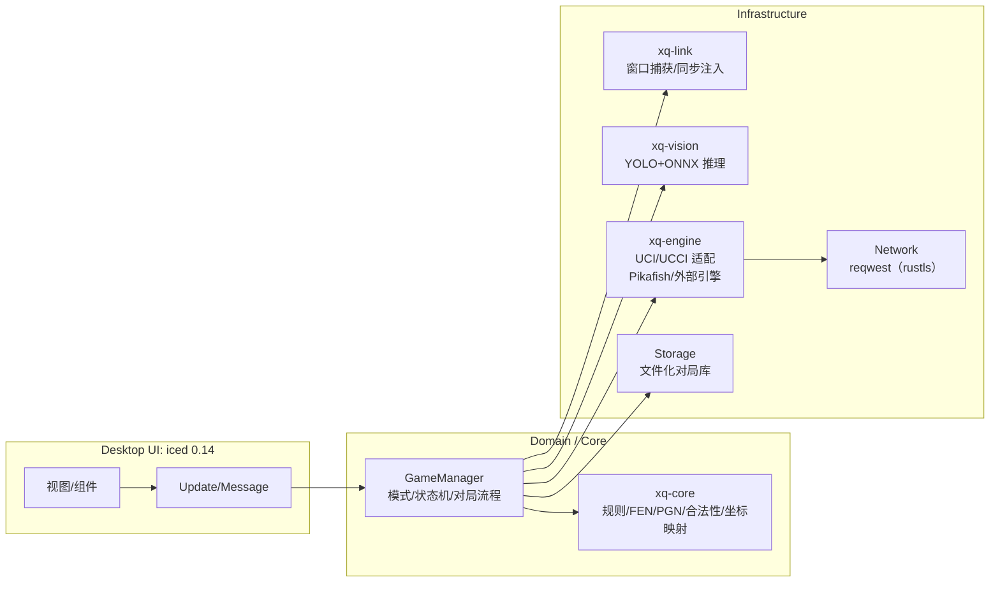
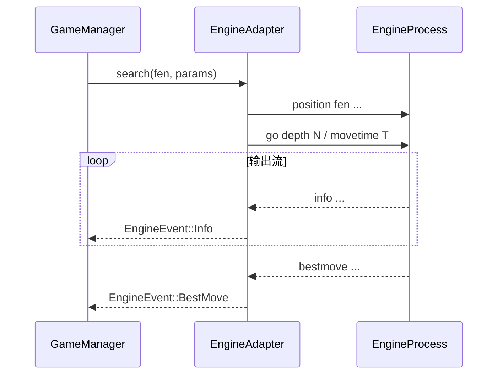
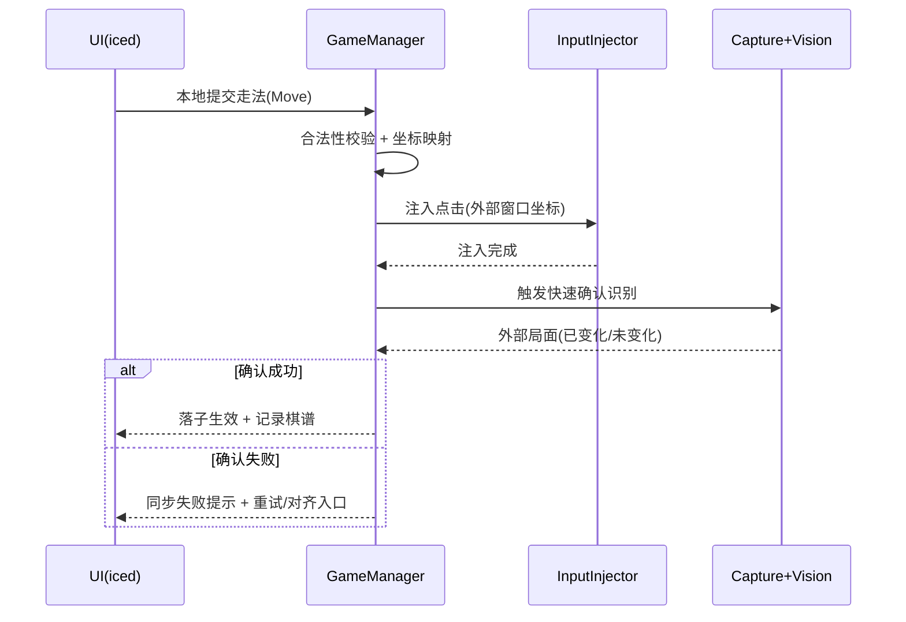
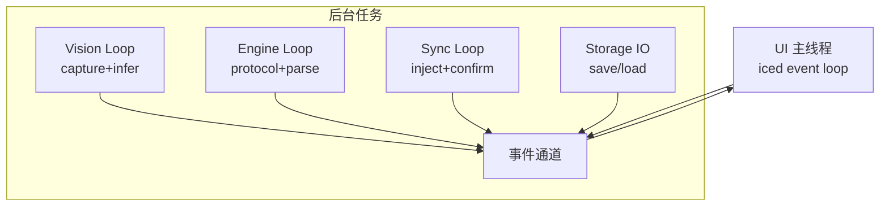

# 中国象棋游戏助手（正式版）技术栈与架构设计

版本：v1.0（正式版规划）  
工程约束：Rust 1.92 / Cargo 1.92 / edition 2024  
最后更新：2026-01-27

落地路径约定：正式版工程放在仓库根目录的 `restruct/` 目录下，采用 Rust workspace；现有 Demo 作为参考实现保留在当前根目录结构中。

## 1. 总体原则（技术选型）

- 优先 Rust 原生、跨平台、高性能、社区活跃的库
- 网络库默认使用 rustls（如 reqwest 的 rustls-tls）
- 避免引入需要额外 C/C++ 依赖（例如 sqlite）、且性能与可维护性不佳的库
- 识别/引擎/同步等后台任务必须与 UI 解耦，确保 UI 主线程流畅

## 2. 已验证可复用能力（来自 Demo）

以下能力在 Demo 中已跑通并建议在正式版继续复用（实现可重构，但资源与核心思路保持）：

- 屏幕窗口枚举与截图：`xcap`
- 棋盘/棋子检测：YOLOv8 ONNX（内置模型字节加载）
  - `libs/large.onnx`
  - `libs/rotate.onnx`（用于非规整棋盘、棋子字体具有多种方向场景，如现实棋盘照片）
- 推理引擎：`ort`（ONNX Runtime）
  - macOS：CoreML EP
  - Linux：CUDA EP
  - Windows：可选 CUDA/DirectML（由 feature 控制）
- 引擎：内置 Pikafish（随应用打包）
  - `libs/pikafish/pikafish-macos`
  - `libs/pikafish/pikafish-linux`
  - `libs/pikafish/pikafish-windows.exe`
  - `libs/pikafish/pikafish.nnue`
- 棋盘内部表示与 FEN/中文着法转换：已有可参考实现（正式版建议抽离为 core crate）

## 3. 正式版目标架构（分层与模块）

正式版采用 **Rust workspace + iced 0.14**，以“领域层可复用”为第一目标，避免 UI/平台能力侵入核心逻辑。

### 3.1 建议的 workspace 划分
- `xq-core`：规则、坐标系统、FEN/PGN、走法合法性、局面差分、翻转映射
- `xq-vision`：截图输入、棋盘定位、YOLO 推理、后处理（detections → board）
- `xq-engine`：UCI/UCCI 协议适配、引擎进程管理、info/bestmove 解析、云库查询（可选）
- `xq-link`：外部窗口连接、裁剪区域管理、输入注入（双向同步）
- `xq-app`：iced UI、路由（模式）、状态管理、对局管理（本地文件）

目录建议（与“restruct 作为正式版根目录”对齐）：

```text
restruct/
  Cargo.toml          # workspace root
  crates/
    xq-core/
    xq-vision/
    xq-engine/
    xq-link/
    xq-app/
```

### 3.2 组件关系图


## 4. UI 技术栈（iced 0.14）

### 4.1 UI 结构建议
- 顶部工具栏：模式/新局/悔棋/提示/设置/棋谱
- 左侧棋盘：可反转、支持点选/拖拽、落子高亮
- 右侧侧栏：局势分析（评分+仪表/曲线）、棋谱记录（步列表）、提示面板

### 4.2 iced 状态管理建议
- 采用“单向数据流”：
  - `AppState`：全局状态（当前模式、对局、设置、引擎状态、识别状态）
  - `Message`：UI 事件与后台事件（识别结果、引擎输出、同步确认等）
  - `update()`：纯逻辑处理（尽量不做阻塞 I/O）
- 后台任务通过 channel 回传事件：
  - `tokio::sync::mpsc` 或 `crossbeam-channel`（若不用 tokio runtime）

## 5. 识别（Vision）技术栈

### 5.1 依赖建议
- `xcap`：窗口枚举、截图
- `ort`：ONNX Runtime（与 Demo 保持一致）
- `ndarray`：推理输入/输出张量
- `image`/`xcap::image`：必要的图像处理（缩放、裁剪）

### 5.2 推理流程（建议保持 Demo 思路）
1. 捕获外部窗口截图（或加载用户上传图片）
2. Resize 到模型输入尺寸（如 640×640）
3. 推理得到 detection 列表（含棋盘框 + 棋子框）
4. 若首次连线：用棋盘框计算裁剪区域并锁定（提高性能与稳定性）
5. detections → board：
   - 根据棋盘网格将中心点映射到 10×9
   - 识别阵营/视角（红/黑）并做必要翻转修正
6. 输出标准化结果：
   - `Board`（10×9 + side-to-move）
   - `FEN`

### 5.4 Demo 已验证的类别映射与限流策略（正式版直接复用语义）

Demo 中模型类别与棋子字符标签、以及 NMS 后的限流上限已经过验证可用。正式版应保持该语义一致，避免训练集与后处理假设错位：

```text
LABELS（class_id -> label）:
0:n 1:b 2:a 3:k 4:r 5:c 6:p 7:R 8:N 9:A 10:K 11:B 12:C 13:P 14:0(棋盘)

LIMIT（每类最多保留数量）:
[2, 2, 2, 1, 2, 2, 5, 2, 2, 2, 1, 2, 2, 5, 1]
```

注：`label == '0'` 代表棋盘框，其余为棋子。

### 5.3 识别稳定性机制（强制）
- 二次确认：同一局面在短时间窗口内重复识别一致才提交
- 状态机：识别失败时不更新局面；连续异常触发降级/暂停

## 6. 引擎（Engine）技术栈：UCI + UCCI

### 6.1 目标
- 抽象出统一的 `EngineAdapter`：
  - 支持内置 Pikafish
  - 支持用户选择外部引擎可执行文件
  - 支持协议 UCI 与 UCCI
- 实现策略约定：
  - 使用 trait 抽象协议与进程行为
  - UCI 与 UCCI 在 v1.0 中一起实现（共享通用抽象，协议差异在适配层处理）
  - 默认内置引擎 Pikafish 使用 UCI 协议

### 6.2 协议适配策略
- 共同抽象（建议）：
  - `init()`：握手（UCI: `uci`/`isready`；UCCI: `ucci`/`isready` 或协议定义的 ready 流程）
  - `setoption(name, value)`
  - `position(fen | startpos + moves)`
  - `go(depth | movetime | wtime/btime ...)`
  - `stop()` / `quit()`
  - 解析 `info` 与 `bestmove`（或 UCCI 对应字段）

UCCI 的定义可参考 xqbase：UCCI 为界面与引擎通过 stdin/stdout 的文本协议（与 UCI 类似，但指令与字段存在差异）。

### 6.3 进程与 I/O 模型（推荐）
- 使用 `tokio::process::Command` + 异步读取 stdout（避免卡死与丢行）
- 每个引擎进程独立任务：
  - `EngineWriter`：发送命令（串行化）
  - `EngineReader`：解析输出并转为结构化事件



### 6.4 引擎参数体系（建议）
- 通用参数（UI 统一展示）：
  - `threads`, `hash`, `depth`, `time`
  - `randomness/selectivity`（若协议与引擎支持）
  - `eval_file/nnue_path`（如 Pikafish 的 `EvalFile`）
- 协议差异参数：
  - UCCI 的 time 单位/参数名可能不同（需在适配器层做映射）

参数优先级约定：`depth` 与 `time` 允许同时下发给引擎；引擎通常在任一条件满足时停止搜索。业务层无需强制二选一，但应在 UI 文案中解释该行为。

### 6.5 云库接口（沿用 Demo，可配置超时，无需 API Key）

正式版可直接复用 Demo 中的 chessdb 查询语义，并将其前置为“可选快速路径”，失败自动回退本地引擎：

```text
HTTP:
  GET http://www.chessdb.cn/chessdb.php
  query:
    action=querypv
    board=<fen>
  headers:
    User-Agent: <browser ua>
    Referer: https://www.chessdb.cn/query/
  timeout:
    Duration::from_secs(timeout)

响应解析（文本）:
  - "" | "unknown" => NotResult
  - "invalid board" | "checkmate" | "stalemate" => InvalidBoard
  - 其余形如: "score:..,depth:..,pv:mv1|mv2|..."
```

工程要求：
- 必须提供超时配置项与合理默认值（Demo 默认 5 秒可作为起点）
- 云库失败不得阻塞 UI，且必须自动回退本地引擎

## 7. 连线与双向同步（Link）

### 7.1 能力拆分
- `Capture`：外部窗口截图 + 棋盘区域裁剪
- `Align`：本地局面与外部识别局面对齐（解决误差与延迟）
- `Inject`：将本地落子注入外部窗口（鼠标点击/拖拽）

### 7.2 输入注入技术选型（建议）
- `enigo`（跨平台鼠标键盘事件注入，纯 Rust 封装平台 API）
- macOS 需要用户授权辅助功能/输入监控，必须做权限检测与引导
  - 现已引入 `enigo` 作为正式版输入注入实现

### 7.3 同步时序（“本地走 → 外部落子 → 识别确认”）


## 8. 棋盘与规则（Core）

### 8.1 数据结构建议
- `Board`：`[[Piece; 9]; 10]` + `SideToMove`
- `Move`：统一 ICCS 坐标（from,to），展示层再转中文
- `GameRecord`：步序列 + 元信息 + 评估曲线

### 8.2 坐标与翻转
- 必须在 `xq-core` 中定义：
  - “棋盘坐标系”（例如 a0..i9）
  - “UI 坐标系”（像素/格子）
  - “外部窗口坐标系”（像素）
  - 反转映射（横纵翻转、阵营修正、UI mirror）

方向约定（非常重要）：
- 连线相关模式下，棋盘方向必须与外部应用保持一致，并禁用手动翻转
- Demo 中已验证的思路可作为基线：
  - 识别阶段先判断 camp（红/黑）
  - 若识别为黑方视角，则对内部 board 执行一次“整体翻转修正”（等价于 `board.reverse()` + 每行 `reverse()`）
  - UI 层通过 mirror 标志保持与外部窗口观感一致

### 8.3 合法性校验范围（v1.0 边界）
- v1.0 仅要求“棋子移动规则正确”
- 长将、长捉、重复局面、60 回合等结果裁定规则暂不在 core 内实现
- 未来如需扩展，可考虑交由引擎或独立规则模块处理

### 8.4 局面差分（board diff）策略建议（以 Demo 思路为基线，正式版更严谨）

Demo 中的最小可用策略为：
- 遍历两帧棋盘差异计数
- 差异数为 2 且存在 from/to 时视为一次正常 Move
- 差异数为 1 视为异常 OneChanged（可能漏检/多检）
- 其余视为 Unknown 并触发重置/回退
- 对识别结果做一次短延时确认（约 100ms）以抑制抖动
- 对 OneChanged 设定阈值（如连续 3 次）后重置状态机

正式版建议在该基线上增强：
- 将 diff 结果作为“候选事件”，必须通过确认窗口或状态机校验后才能落盘
- 为 One/Unknown 分类提供明确回退路径（对齐、降级只读、或等待下一帧确认）
- 将 diff 分类与识别置信度、棋子数量约束联合判定

## 9. 本地存储（避免 sqlite）

### 9.1 v1.0 推荐：文件化存储（P0）
- `*.pgn`：棋谱导出/分享
- `*.json`：对局元信息、评估曲线、引擎参数快照
- 优点：零依赖、跨平台、易备份

默认落盘位置约定：应使用各 OS 推荐的应用数据目录（如 Windows AppData、macOS Application Support、Linux XDG 数据目录），避免将正式数据写入仓库目录。

快照（Snapshot）策略约定：
- 术语统一使用“快照”，不再使用“草稿”
- 自动保存不采用时间策略；每一步走子后立即保存快照
- 连线相关模式不产生快照（因无法可靠恢复）
- 每个客户端最多保留 1 份快照，新快照覆盖旧快照
- 启动时若检测到快照存在，不自动恢复，应弹窗提示“存在未完成对局，是否继续”
- 选择“是”时恢复：快照记录的模式与对局棋盘状态
- 选择“否”时处理：进入默认启动状态并删除快照

### 9.2 可选：纯 Rust KV 存储（P1）
如需要更快的索引与查询，可选用纯 Rust 库（避免 C 依赖）：
- `redb`：嵌入式 KV（纯 Rust）

## 10. 网络与在线资源

- `reqwest` + `rustls-tls`：云库查询、更新检查（如未来模型/开局库下载）
- 超时与失败降级必须完备（云库不可用不影响本地引擎）

## 11. 打包与资源管理

### 11.1 资源布局（建议与 Demo 保持一致）
- `libs/`：
  - `pikafish/`：各平台二进制 + nnue
  - `large.onnx`、`rotate.onnx`
- UI 资源（棋盘/棋子图片等）：随程序资源打包

### 11.2 运行时资源解析
- 不在日志中输出用户路径、截图内容等敏感数据
- 对外部引擎路径做存在性与可执行性校验

## 12. 并发与性能策略

### 12.1 线程/任务模型


### 12.2 降级开关（建议）
- 降低识别频率（timer interval）
- 限制最大深度/最大思考时间
- 限制显示 PV 数量（例如 Top3）
- 当同步失败/识别异常时回退只读分析

## 13. 测试与质量保障

- `xq-core` 必须具备单元测试：
  - FEN 解析/生成互逆
  - 坐标映射与反转正确性
  - 走法合法性（覆盖棋子移动规则与常见非法走子；不强制覆盖长将/长捉等裁定规则）
- `xq-engine` 协议解析测试：
  - info/bestmove 行解析
  - UCI/UCCI 兼容性样例（可用 golden test）
- `xq-vision`：
  - detections → board 后处理测试（使用固定检测样本）

## 14. 安全与合规（同步功能特别注意）

- 双向同步默认关闭，启用时明确提示风险与平台规则
- macOS 权限申请流程必须清晰可回退

## 15. 进度快照（2026-01-27）

- 已完成实施计划 Step 1 的基础骨架落地。
- 新增 `restruct/` Rust workspace 与 `xq-core / xq-vision / xq-engine / xq-link / xq-app` 五个 crate。
- 所有 crate 统一 `edition = 2024`，并预留 `rotate / gpu` feature（当前为空实现，用于先打通构建链路）。
- `xq-app` 增加“资源自检”启动逻辑：在开发态通过 `CARGO_MANIFEST_DIR` 反推出仓库根目录，并检查 `libs/large.onnx`、`libs/rotate.onnx`、`libs/pikafish/pikafish.nnue` 与当前平台的 Pikafish 可执行文件是否存在。
- 已完成实施计划 Step 2（`xq-core` 规则与数据模型）：
- `xq-core` 现已提供 `Board / Move / Pos / Piece / Side / GameRecord` 等核心类型。
- 已提供中象 FEN 解析与生成：`Board::from_fen / Board::to_fen`。
- 已提供局面差分能力：`diff_boards` + `BoardDiffKind`（候选事件语义）。
- 已提供棋盘翻转与坐标映射：`flip_pos / flip_move / map_pos_with_flip / Board::flipped`。
- 已提供 v1.0 范围内的合法性校验：`check_move_legality`（含将帅照面约束）。
- 已完成实施计划 Step 3（`xq-engine` 引擎抽象与协议适配）：
- `xq-engine` 已按模块拆分：`adapter / protocol / profile / parser / process / uci / ucci`。
- 已提供统一抽象：`EngineAdapter` trait + `EngineEvent::{Info,BestMove}` 事件模型。
- 已提供协议映射入口：`SearchParams::to_go_command(protocol)` 与 `EngineProfile::to_setoption_commands()`。
- 当前进程模型为“标准库实现”（适配离线环境）：`std::process::Command` + 后台读取线程 + `std::sync::mpsc` 通道。
- 已在 `uci.rs` 提供“假引擎脚本”测试，覆盖握手、解析与事件通路。
- 已完成实施计划 Step 4（`xq-vision` 识别管线骨架与工程化落地）：
- `xq-vision` 已按职责拆分模块：`input / model / detect / crop / postprocess / stability / pipeline`。
- 输入源已统一抽象：`CaptureInput` 同时支持 `WindowCapture` 与 `ImageFile`。
- 模型与推理栈已落地：`ort = 2.0.0-rc.9`，并显式钉住 `ort-sys = 2.0.0-rc.9` 以避免 rc.10 兼容性问题。
- 后处理已与 core 坐标体系对齐：基于 `detections_to_observation` 输出 `xq_core::Board`，并在黑方底线视角时使用 `flip_pos` 做 180° 翻转。
- 识别稳定性机制已前置工程化：`StabilityFilter` 基于 `diff_boards` 的候选事件语义处理 `MoveCandidate / OneChanged / 其它异常`。
- 已完成实施计划 Step 5（`xq-link` 连线与双向同步骨架）：
- `xq-link` 新增窗口枚举与连接能力：`list_windows / LinkWindow / WindowPosition`。
- 新增棋盘几何映射：`BoardGeometry` 支持裁剪区域 → 格子中心点 → 屏幕坐标（含缩放因子）。
- 新增同步对齐状态机：`SyncState / ExternalUpdate / PendingInjection` 支持候选走法确认与注入后对齐。
- 新增输入注入接口与 `enigo` 实现：`InputInjector / EnigoInjector`，并提供点击序列计划。
- 新增 macOS 权限检查入口：`check_input_permission`（辅助功能/输入监控提示）。
